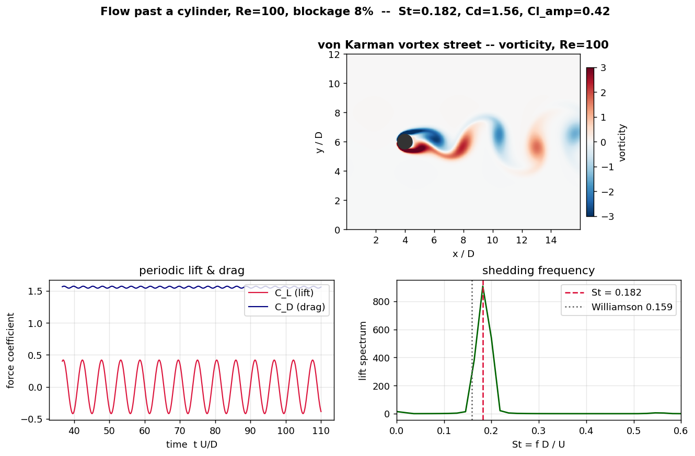

# Vortex Street — a from-scratch fluid solver, run backwards to read the flow

A 2D incompressible Navier–Stokes solver written from scratch in numpy, used to
model flow past a cylinder (the von Kármán vortex street and vortex-induced
vibration), and then inverted: from the wake signal it recovers the free-stream
flow speed, with quantified uncertainty.



## What it does

**Forward** — solves `∂u/∂t + (u·∇)u = −∇p + ν∇²u`, `∇·u = 0` on a staggered
(MAC) grid with Chorin projection (the pressure Poisson equation solved spectrally
with a cosine transform). A cylinder is an immersed boundary (volume penalisation)
whose penalty reaction is the hydrodynamic force. Above Re ≈ 47 the wake sheds the
von Kármán vortex street; on a spring, the cylinder undergoes vortex-induced
vibration lock-in.

**Backward** — a bluff body sheds at `f = St(Re)·U/D`. A vortex flow-meter reads
the flow speed straight off that frequency. The same is done here on the solver:
known `U` → it sheds at `f` → invert `St(Re)` → recover `U`, with a 95% CI from a
sensor-noise Monte-Carlo.

## Verification

| Check | This solver | Reference | |
|---|---|---|---|
| Lid-driven cavity centreline u,v (Re=100) | RMS 2.2·10⁻³ / 4.5·10⁻³ | Ghia, Ghia & Shin 1982 | ok |
| Steady wake bubble L_w/D (Re=20 / 40) | 0.88 / 2.03 | 0.93 / 2.24 (Coutanceau–Bouard) | ok |
| Shedding Strouhal St (Re=100) | 0.18 | 0.16 unbounded (Williamson 1988) | + blockage |
| Drag Cd, lift Cl (Re=100) | 1.56 / 0.42 | ~1.33 / ~0.33 unbounded | + blockage |
| VIV lock-in peak A/D | `viv_lockin.png` | ~0.5–0.6 (Khalak & Williamson) | ok |
| Flow-meter round-trip: recover U | `flowmeter_roundtrip.png` | known input U (± CI) | ok |

A finite domain confines the flow (blockage), raising St, Cd and Cl above the
unbounded references; the offset is reported (St: 0.20 at 17% blockage → 0.18 at
8% → toward 0.16 as the walls recede) rather than tuned away. The inverse uses
`St(Re)` calibrated from the solver, so the blockage cancels in the round-trip —
the same way a real meter is calibrated per device.

## Run it

```bash
python solver/verify_cavity.py 100 128   # solver correctness vs Ghia 1982
python solver/verify_cylinder.py 100     # vortex street: St/Cd/Cl (+ snapshot)
python solver/verify_cylinder_steady.py  # steady wake length vs literature
python solver/verify_viv.py              # vortex-induced vibration lock-in
python solver/verify_flowmeter.py        # the inverse: recover flow speed + CI
python solver/export_web.py 100          # bake the web animation
```
Then open `web/index.html` — a live vortex street, data injected, no server.

## Limitations

2D and laminar (Re up to a few hundred); a single circular cylinder; volume
penalisation gives ~O(√η) boundary accuracy and a slightly fat cylinder;
finite-domain blockage shifts the force coefficients (quantified, and it cancels
in the inverse); explicit time stepping caps the step.

---

*References: Ghia et al. 1982; Williamson 1988/1996; Coutanceau & Bouard 1977;
Khalak & Williamson 1999. Pressure Poisson via DCT; immersed boundary via volume
penalisation (Angot et al.). Vortex flow-meter principle: f = St·U/D.*
